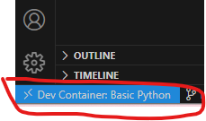
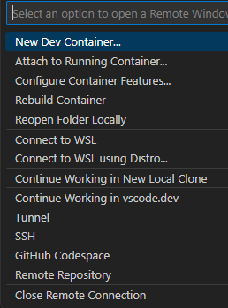

# devcontainer

### Endre pythonversjon
Endre base image i Dockerfile, og bygg image på nytt
```dockerfile
FROM library/python:3.10-bookworm

COPY requirements.txt /tmp/requirements.txt
```

### Legge til python-pakker i image:
Legg til pakke og evt versjon i requirements, og bygg image på nytt: 




### Legge til standard vs-code extensions
Legg til extension id i lista i .devcontainer/.devcontainer.json: 
```json
"customizations": {
    "vscode": {
      "extensions": [
        "ms-python.python",
        "mhutchie.git-graph",
        "donjayamanne.githistory",
        "eamodio.gitlens"
      ]
    }
  },
```

